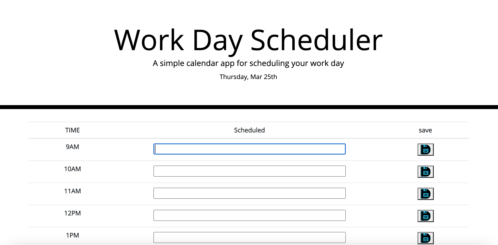

# 05 Third-Party APIs: Work Day Scheduler

## Task 

In this assignment we created a simple calendar application that allows users to save events for each hour of the day by modifying starter code. This application runs in the browser and features dynamically updated HTML and CSS, powered by jQuery. 

I used the [Moment.js](https://momentjs.com/) library to work with the date and time. 

## User Story

As a busy employee I want to add important events to a daily schedule planner to organize tasks. 

Link to deployed application:

Link to GitHub repository: